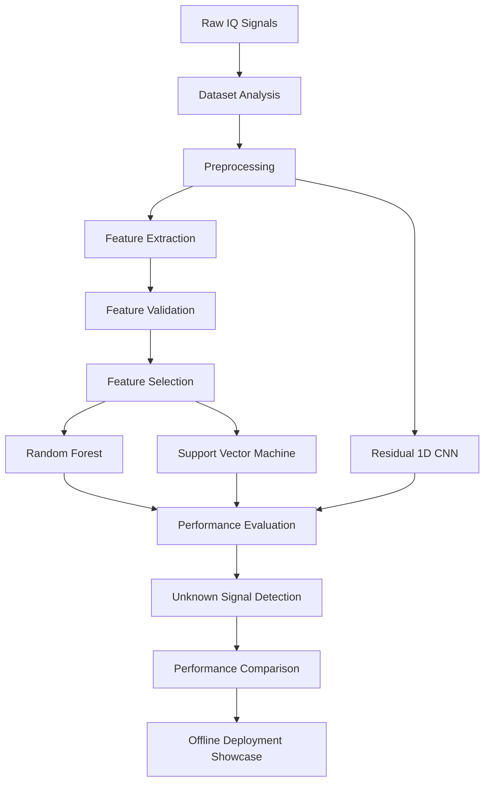
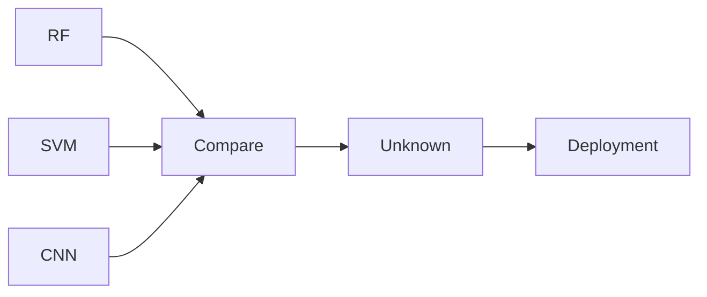

````markdown
<div align="center">

# 📡 RF Signal Classification using Machine Learning

### Automatic Modulation Classification using Random Forest • SVM • Residual 1D CNN

<p align="center">

</p>

<p align="center">


</p>

<h3 align="center">

An End-to-End Automatic Modulation Classification (AMC) System capable of identifying RF modulation schemes from raw IQ signals using both Traditional Machine Learning and Deep Learning.

</h3>

---

⭐ **If you like this project, please consider giving it a star!**

</div>

---

# 📑 Table of Contents

- [Overview](#-overview)
- [Project Highlights](#-project-highlights)
- [System Architecture](#-system-architecture)
- [Workflow](#-workflow)
- [Project Structure](#-project-structure)
- [Dataset](#-dataset)
- [Models](#-models)
- [Results & Evaluation](#-results--evaluation)
- [Unknown Signal Detection](#-unknown-signal-detection)
- [Deployment Showcase](#-deployment-showcase)
- [Installation](#-installation)
- [Usage](#-usage)
- [Applications](#-applications)
- [Future Scope](#-future-scope)
- [Authors](#-authors)

---

# 📖 Overview

Automatic Modulation Classification (AMC) is a critical task in wireless communication systems, spectrum monitoring, cognitive radio, signal intelligence, and electronic warfare.

This project presents a complete RF Signal Classification pipeline capable of identifying multiple digital and analog modulation schemes directly from IQ samples.

Unlike conventional projects that focus only on model training, this repository contains the **complete development lifecycle**, including:

- Dataset Analysis
- Data Preprocessing
- Feature Engineering
- Feature Selection
- Machine Learning Models
- Deep Learning Models
- Model Evaluation
- Unknown Signal Detection
- Offline Deployment Demonstration

---

# ✨ Project Highlights

| Feature | Status |
|----------|:------:|
| RF Signal Classification | ✅ |
| Random Forest | ✅ |
| Support Vector Machine | ✅ |
| Residual 1D CNN | ✅ |
| Feature Extraction | ✅ |
| Feature Selection | ✅ |
| Dataset Cleaning | ✅ |
| Accuracy vs SNR Analysis | ✅ |
| Unknown Signal Detection | ✅ |
| Confidence-Based Prediction | ✅ |
| Offline Deployment | ✅ |
| DRDO Showcase | ✅ |

---

# 🏗️ System Architecture



---

# 🔄 Workflow

```text
Raw IQ Signals
        │
        ▼
Dataset Preparation
        │
        ▼
Preprocessing
        │
        ▼
Feature Extraction
        │
        ▼
Feature Validation
        │
        ▼
Feature Selection
        │
 ┌──────┴─────────────┐
 │                    │
 ▼                    ▼
Random Forest       SVM
 │                    │
 └────────┬───────────┘
          │
          ▼
Performance Evaluation

──────────────────────────────

Raw IQ Signals
        │
        ▼
Residual CNN
        │
        ▼
Prediction

──────────────────────────────

RF + SVM + CNN
        │
        ▼
Performance Comparison
        │
        ▼
Unknown Signal Detection
        │
        ▼
Offline Deployment
```

---

# 📂 Project Structure

```text
RF-Signal-Classification
│
├── 📁 data
│   ├── raw
│   ├── processed
│   └── samples
│
├── 📁 notebooks
│   ├── Dataset Analysis
│   ├── Preprocessing
│   ├── Feature Extraction
│   ├── Dataset Cleaning
│   ├── Feature Validation
│   ├── Feature Selection
│   ├── Random Forest
│   ├── Support Vector Machine
│   ├── CNN Dataset Preparation
│   ├── CNN Training
│   ├── CNN Evaluation
│   ├── Performance Analysis
│   └── Unknown Signal Detection
│
├── 📁 src
│   ├── data
│   ├── features
│   ├── machine_learning
│   ├── deep_learning
│   └── utils
│
├── 📁 models
│
├── 📁 demo
│   └── showcase.py
│
├── 📁 results
│
├── requirements.txt
└── README.md
```

---

# 📊 Dataset

### Dataset Used

- RadioML Inspired Dataset
- Synthetic RF Dataset

### Supported Modulations

| Digital | Analog |
|----------|---------|
| BPSK | AM-DSB |
| QPSK | AM-SSB |
| 8PSK | |
| PAM4 | |
| GFSK | |
| CPFSK | |
| QAM64 | |

---

# 🤖 Models

## 🌳 Random Forest

✔ Feature Based

✔ Fast Training

✔ High Interpretability

---

## 📈 Support Vector Machine

✔ Feature Based

✔ Strong Decision Boundary

✔ Excellent Generalization

---

## 🧠 Residual 1D CNN

✔ End-to-End Learning

✔ Automatic Feature Learning

✔ Residual Connections

✔ Raw IQ Input

---

# ⚙️ Technologies Used

| Category | Technologies |
|------------|--------------|
| Programming | Python |
| Machine Learning | Scikit-Learn |
| Deep Learning | PyTorch |
| Data Processing | NumPy, Pandas |
| Visualization | Matplotlib |
| Development | Jupyter Notebook |
| Model Storage | Joblib, Pickle |

---

# 📈 Results & Evaluation

Models are evaluated using:

- Accuracy
- Precision
- Recall
- F1 Score
- Confusion Matrix
- Per-Class Accuracy
- Accuracy vs SNR
- Model Size
- Inference Time
- Confidence Distribution

---

# 📊 Performance Pipeline



---

# 🚨 Unknown Signal Detection

Instead of forcing every received signal into a known modulation class, the project performs confidence-based rejection.

```text
Prediction
      │
      ▼
Confidence Score
      │
      ▼
Confidence > Threshold ?
      │
 ┌────┴────┐
 │         │
Yes       No
 │         │
Known    Unknown
Signal   Signal
```

This significantly improves deployment reliability.

---

# 🖥️ DRDO Showcase

The project includes a complete demonstration application.

Features:

- Load trained models
- Random signal selection
- Live prediction
- Confidence comparison
- Model comparison
- Majority voting
- Unknown signal detection
- Automatic visualization generation

---

# 📸 Screenshots

<p align="center">


</p>

---

## 📈 Accuracy vs SNR

<p align="center">


</p>

---

## 📊 Confusion Matrix

<p align="center">


</p>

---

## 📉 CNN Training Curves

<p align="center">


</p>

---

# 🎥 Showcase Demo

<p align="center">


</p>

---

# 🚀 Installation

Clone the repository

```bash
git clone https://github.com/<your-username>/RF-Signal-Classification.git

cd RF-Signal-Classification
```

Install dependencies

```bash
pip install -r requirements.txt
```

---

# ▶ Usage

### Random Forest

```bash
python train_random_forest.py
```

---

### SVM

```bash
python train_svm.py
```

---

### CNN

```bash
python train_cnn.py
```

---

### Run Deployment Showcase

```bash
python demo/showcase.py
```

---

# 🎯 Applications

- 📡 Automatic Modulation Classification
- 📶 Cognitive Radio
- 🛰 Spectrum Monitoring
- 🛡 Electronic Warfare
- 🔐 Wireless Security
- 📻 Software Defined Radio
- 📈 Signal Intelligence
- 📚 Communication Research

---

# 🛣️ Future Scope

- [x] Random Forest
- [x] Support Vector Machine
- [x] Residual CNN
- [x] Unknown Signal Detection
- [x] Offline Deployment
- [ ] Transformer-based Models
- [ ] GNU Radio Integration
- [ ] SDR Hardware Testing
- [ ] FPGA Deployment
- [ ] ONNX Export
- [ ] Edge AI Deployment

---

# 👥 Authors

<div align="center">

### 👨‍💻 Shaad Ali

Machine Learning • Signal Processing • Project Development

---

### 👨‍💻 Yugratna

Machine Learning • Feature Engineering • Model Development

---

### 👩‍💻 Suhani Pareek

Deep Learning • Deployment • CNN Development

</div>

---

# 🙏 Acknowledgements

Special thanks to:

- Defence Research and Development Organisation (DRDO)
- RadioML Dataset
- Scikit-Learn
- PyTorch
- Open Source Community

---

<div align="center">

## ⭐ If you found this repository useful, please consider giving it a Star!

Made with ❤️ using Python, PyTorch and Scikit-Learn.

</div>
````
~